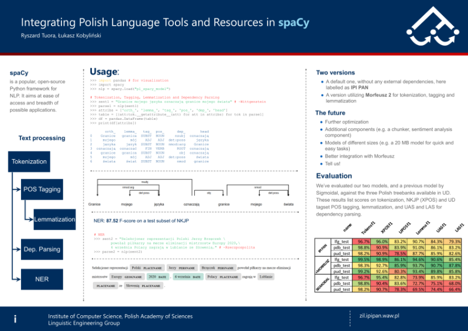

# spaCy: Polish language pipeline and models

## Where to get it
The latest versions of the models are available here: [http://zil.ipipan.waw.pl/SpacyPL](http://zil.ipipan.waw.pl/SpacyPL)

## Requirements
Spacy in a version `== 2.2.4`.

## Installation
First, you need to install spaCy (we need versions `== 2.2.4`). Please refer to the [official documentation](https://spacy.io/usage) to do so.

For example, using Anaconda:

```bash
conda install -c conda-forge spacy
```

Then, after downloading the package, install it as any other python module: 

```bash
python -m pip install PATH/TO/pl_spacy_model-x.x.x.tar.gz
```

If you can install the [Morfeusz 2](http://morfeusz.sgjp.pl/download/en) bindings for Python, we reccomend using the `pl_spacy_model_morfeusz` version of our model, which is superior in performance. For details, please see the __pl_spacy_model_morfeusz__ section below.

```bash
python -m pip install PATH/TO/pl_spacy_model_morfeusz-x.x.x.tar.gz
```

## Quick start

```python
import spacy
nlp = spacy.load('pl_spacy_model') # or spacy.load('pl_spacy_model_morfeusz')

# List the tokens including their lemmas and POS tags
doc = nlp("Granice mojego języka oznaczają granice mojego świata") # ~Wittgenstein
for token in doc:
    print(token.text, token.lemma_, token.tag_)
```

## A more complete example
Please see this [Jupyter notebook](https://nbviewer.jupyter.org/github/ipipan/spacy-pl/blob/master/spaCy-PL-demo.ipynb)

or this [poster](poster.pdf) and [presentation](presentation.pdf).

## What is included?

### Lemmatizer
The lemmatizer is implemented as a look-up table, using a lemma dictionary imported from the [Morfeusz morphological analyzer](http://morfeusz.sgjp.pl/).

### Tagger
The tagger has been trained on a corpus consisting of the 1 million word subcurpous of the [National Corpus of Polish](http://clip.ipipan.waw.pl/NationalCorpusOfPolish} and the 500k [Frequency Corpus of the 1960s Polish language](http://clip.ipipan.waw.pl/PL196x). For tasks involving Polish language only, we reccomend using the internal tagset (`token.tag_` as opposed to `token.pos_`), because the latter is a lossy mapping of the former.

### Depenendency Parser
For training a dependency parser, we've used the [PDB UD treebank](https://universaldependencies.org/treebanks/pl_pdb/index.html)

### Named Entity Recognizer
NER model has been trained on the 1 million word subcurpous of the [National Corpus of Polish](http://clip.ipipan.waw.pl/NationalCorpusOfPolish). 

### Flexer
The morfeusz-based model additionally incorporates a custom inflection component. It is deterministic and works by consulting both the tagger and the dictionaries of morfeusz. For details please see the [notebook](https://nbviewer.jupyter.org/github/ipipan/spacy-pl/blob/master/spaCy_PL_morfeusz_demo.ipynb).

### Word embeddings
Word embeddings trained on KGR10 corpus (over 4 billion of words) using Fasttext by Jan Kocoń and Michał Gawor (https://clarin-pl.eu/dspace/handle/11321/606). Our model uses only the vector representation for 800.000 most frequent words.

Please see this [Jupyter notebook](https://nbviewer.jupyter.org/github/ipipan/spacy-pl/blob/master/spaCy-PL-embeddings.ipynb) for a demo.

## pl_spacy_model_morfeusz
This version of our model utilizes an external dependency: Morfeusz 2. We reccomend using this version, as it is significantly better for all the tasks involved. To do so you need to first install the Morfeusz 2 library, and its embeddings for Python. The detailed instructions for your architecture are available [here](http://morfeusz.sgjp.pl/download/en): Morfeusz 2 bindings are installed via easy_install, and not via pip, although we are discussing the option to switch onto pip into the future. If Morfeusz 2 is not installed correctly, you will see a warning message and the model will not work as expected.

Morfeusz 2 is used within our custom pipeline component called Preprocessor. The Preprocessor first tokenizes the text, and then performs morphosyntactic analysis, and lemmatization. Since Morfeusz 2 offers multiple analyses for each token, we disambiguate these using our tagger. From `0.1.0` onwards the tagger is a integrated version of [Toygger](http://zil.ipipan.waw.pl/Scwad) (for more info see the bibliography below). Because of this there is no separate tagger component in our pipeline (although there is a tagger in the model), and you cannot skip tagging during the processing stage.

In this version of the model, the `token.tag_` attribute returns the POS tag only. All the morphological features are stored in `token._.feats` custom attribute. 

This [notebook](https://nbviewer.jupyter.org/github/ipipan/spacy-pl/blob/master/spaCy_PL_morfeusz_demo.ipynb) shows some features of the model with Morfeusz 2.

## Evaluation metrics
Both the poster and the article list the evaluation scores for 0.0.3 version, for up to date results please see the `evaluation` folder.

## Change history
 * 0.1.0 
  * reduced the size of the model
  * added the flexer component
  * added the capabilities for full morphosyntactic analysis using Toygger
 * 0.0.5 -- several changes
   * corrected errors in NER model,
   * parser now performs sentencization correctly (you can parse whole documents now, instead of individual sentences)
   * parser trained on PDB treebank (instead of LFG),
   * added version using Morfeusz library as an external dependency; more detailed morphosyntactic tags are available in token.tag_ attribute.
 * 0.0.3 -- added support for spaCy 2.2

## Authors
Ryszard Tuora

supervision: Łukasz Kobyliński

## Licensing

Both models are available on the GNU GPL 3.0 license, which allows for commercial use. 

## Citing
Ryszard Tuora and Łukasz Kobyliński, "Integrating Polish Language Tools and Resources in spaCy". In: Proceedings of PP-RAI'2019 Conference, 16-18.10.2019, Wrocław, Poland.

[](poster.pdf)

## Bibliography

For more info about Toygger, see here:

`Katarzyna Krasnowska-Kieraś. Morphosyntactic disambiguation for Polish with bi-LSTM neural networks. In Zygmunt Vetulani and Patrick Paroubek, editors, Proceedings of the 8th Language & Technology Conference: Human Language Technologies as a Challenge for Computer Science and Linguistics, pages 367–371, Poznań, Poland, 2017. Fundacja Uniwersytetu im. Adama Mickiewicza w Poznaniu.
`
